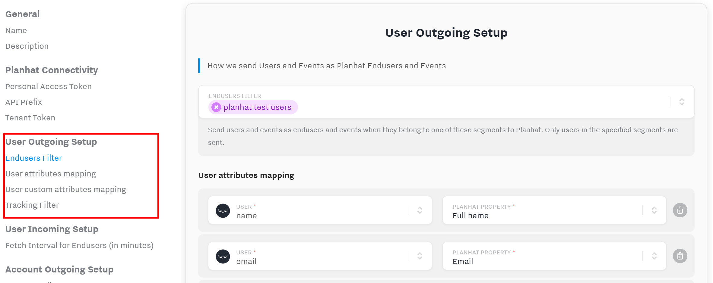

# Hull - Planhat Connector

> This connector is currently in Beta. While we always strive for high quality releases, we cannot guarantee that beta connectors are free of bugs.

This connector enables you to send Hull user and accounts to Planhat contacts and companies and also allows you to track events in Planhat.

This document was last updated on August 29, 2019. If you want to help us improve this documentation or have some feedback, please [contact us](https://help.hull.io/hc/en-us/requests/new)!

## Getting Started

1. From your Hull Connectors page click on 'Add a connector'
2. Search for 'Facebook Offline Conversions' and click on 'Install'
3. Authorize Hull to send data on your behalf by configuring the Planhat Connectivity section:
   
   Please obtain the `Personal Access Token` and `Tenant Token` from Planhat as well as the `API Prefix`. If you need help in obtaining any of this information, please refer to the [Planhat documentation](https://docs.planhat.com).

## Control outgoing data flow

### User data from Hull to Contacts in Planhat

You can synchronize user attributes from Hull with Planhat contacts by specifying one or more user segments in the `Contact Filter` and making the required mappings under `User attributes mapping`:

_Note_: The segments cannot have the event as a condition, because evaluation takes place after the event occured. So the connector won't recognize that the user is in the segment. We recommend to use a generic segment, e.g. users with external_ids which ensures that users will be in the segment before the event is registered.

The connector will check the conditions in the following order:

1. Check if the user is in one of the segments listed under `Contact Filter`
2. Check if a new event occured which is in the `Tracking Filter`

The connector will send events with the `action` set to name of the event in Hull and all properties passed as `info` parameter to the Planhat API. If present, the name, email and external_id of the Hull user will be send along to attribute the event to the appropriate contact in Planhat.

### Account data from Hull to Companies in Planhat

You can synchronize account attributes from Hull with Planhat companies by specifying one or more account segments in the `Company Filter` and making the required mappings under `Account attributes mapping`:

Only accounts with an `external_id` in Hull can be synchronized to Planhat to ensure proper deduplication.

If you want the connector to assign `Owner` and `Co-Owner` in Planhat, you need to specify an attribute which has the value of the Planhat ID of the User who should be the owner or co-owner. If you send an invalid value, the payload will be rejected by the connector and no API call to Planhat will be executed; the connector will log an `outgoing.account.skip` message in this case with a reason of `Invalid Owner ID` or `Invalid Co-Owner ID`. _This feature is available since version 0.1.5_

_Note_: The account must be in one of the whitelisted segments. The connector won't synchronize a linked account based on the fact that the user matches a whitlisted segment in the `Contact Filter`.

#### Synchronization of Licenses

Licenses are dependent objects from companies in Planhat. Hull doesn't have a dedicated object for licenses, but the Planhat connector enables you to synchronize an account attribute which needs to be of type `JSON`. This JSON attribute needs to be an array of objects and can be configured under `Licenses account attribute`.
The next step to synchronize licenses is to specify the mappings for each object in the JSON array under `Licenses attributes mapping`. There is no input help available for the Hull Attribute, so be careful when mapping the data since the entries are case-sensitive. To avoid issues, you should stay clear of using spaces in the attributes stored in Hull.
You also have the option to map custom attributes for licenses, please refer to the [Planhat docs](https://docs.planhat.com/?version=latest#0a0754bd-9def-4e21-afc4-0d0f2e3b58dd) for further details and best practices. _This feature is available since version 0.1.6_

### Internal API

The connector exposes an internal API which you can leverage in the Processor to perform additional operations while using the configured authentication of your Planhat connector.

**Warning** This is an advanced feature of the connector and you are responsible for implementing the proper logic yourself. Please consult the Planhat documentation for additional information and/or Hull Support.

#### Authentication

The internal API is secured with Basic Auth using the credentials of the connector:

| Basic Auth | Connector Credential |
| ---------- | -------------------- |
| Username   | Connector ID         |
| Password   | Connector Secret     |

The organization needs to be passed along as querystring parameter `org`. Request which are not properly authenticated will be rejected with error codes `400`, `401` or `403`.

#### Users

The connector exposes an internal API which allows the management of Users in Planhat to list, read, create or update users.

| ID           | Endpoint                    | Method | Description                   |
| ------------ | --------------------------- | ------ | ----------------------------- |
| users.list   | /api/internal/users         | GET    | List all users (cached)       |
| users.get    | /api/internal/users/:userId | GET    | Get a users by its Planhat ID |
| users.create | /api/internal/users         | POST   | Create a new user             |
| users.update | /api/internal/users/:userId | PUT    | Update an existing user       |

The users endpoints are a wrapper around the Planhat API endpoints for Users as documented [here](https://docs.planhat.com/?version=latest#e6b6e1a8-e175-404b-8daf-71554c8c4264).

**Note:** The list endpoint uses a caching mechanism and keeps results up to 10 minutes in the cache. To force cache invalidation, use the querystring parameter `&cacheclear=1`.
